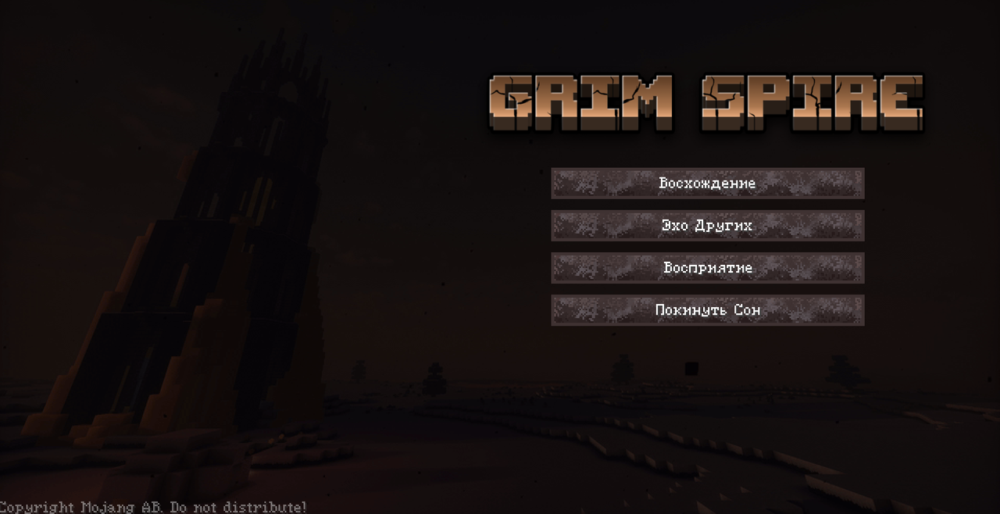
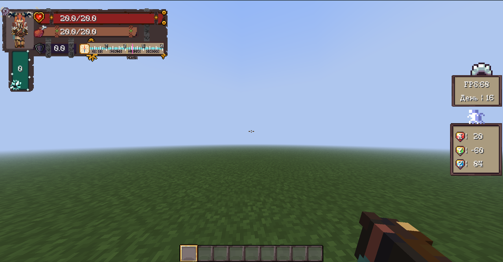
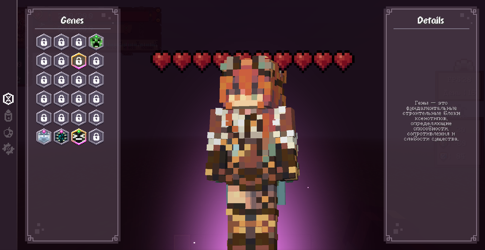

# Grim Spire  
### The Evolving RPG Adventure • Minecraft 1.20.1 • Fabric

**A custom RPG adventure built around freedom, world evolution, and a bespoke visual identity.**  
**Авторская RPG-сборка про свободу, эволюцию мира и уникальный визуальный стиль.**

 

 

---

## 🌑 Overview / О проекте
**EN:** Grim Spire is a custom-built RPG adventure designed for players who value freedom and deep immersion.  
No artificial resource locks — explore and gather at your own pace from the very beginning.  
Progress evolves the world Terraria-style: new threats, events, and challenges emerge as you advance.

**RU:** Grim Spire — авторское RPG-приключение для тех, кто ценит свободу и атмосферу.  
Без искусственных ограничений: исследуйте мир и добывайте ресурсы с самого начала.  
Прогресс эволюционирует мир по принципу Terraria: новые опасности, события и испытания появляются по мере развития.

---

## ⚔️ Key Features / Ключевые особенности
- **Staged Difficulty (Terraria-style)** — the world evolves as you progress  
  **Поэтапная сложность** — мир меняется вместе с вашим прогрессом
- **Total Freedom & Flexible Roles** — swap builds on the fly, adapt to the team  
  **Свобода и гибкие роли** — меняйте билды и роли по ситуации
- **Bespoke Hand-Drawn HUD** — fully redesigned UI for a unique visual identity  
  **Авторский HUD** — полностью перерисованный интерфейс
- **Genetic Evolution** — discover and combine genes for buffs & abilities  
  **Гены** — комбинируйте гены для усилений и способностей
- **High-Quality Localization & Sound** — translation + atmosphere-focused audio  
  **Локализация и звук** — перевод + атмосферное звуковое оформление

---

## 🖼️ Screenshots / Скриншоты

### HUD

### Genes

---

## ⬇️ Download
- **Latest release:** https://github.com/nuchohen/grim-spire/releases/latest  
- **All versions & changelog:** https://github.com/nuchohen/grim-spire/releases

---

## 🧩 Installation (Prism Launcher)
1) Download the latest release  
2) Prism: **Add Instance → Import** (if it’s a Prism ZIP)  
   or copy `mods/` + `config/` into your instance  
3) Launch **Minecraft 1.20.1 Fabric**

---

## 📬 Contacts
- Discord: (add link)
